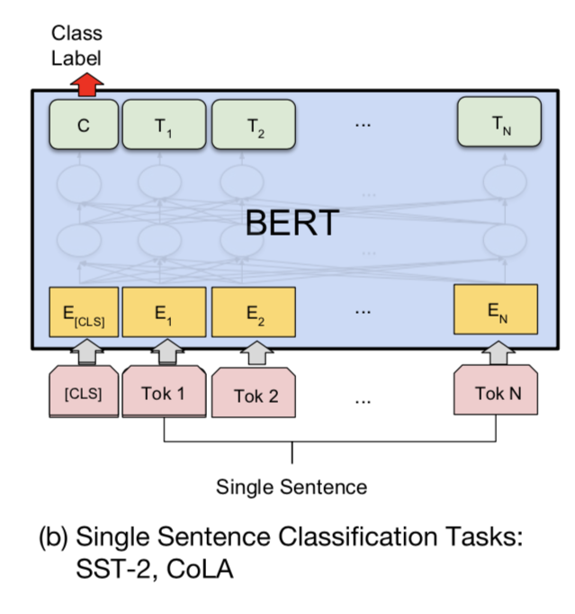

# NLP_sst2
Homework for sst2. Including all codes and datasets of sst2 sentiment classification task.

## Dataset
Auto imported from Huggingface Datasets by `dataset` module.
Can also be grabbed from url: https://dl.fbaipublicfiles.com/glue/data/SST-2.zip

The `Stanford Sentiment Treebank (SST)` consists of sentences from movie reviews and human annotations of their sentiment. The task is to predict the `sentiment` of a given sentence. It uses the `two-way (positive 1 / negative 0)` class split, with only sentence-level labels. The percentage of both positive sentences and negative sentences are both about 50%. The following is a part of `train.tsv` from sst2 datasets.

| **sentence**                                              | **label**  |
|-----------------------------------------------------------|------------|
| saw how bad this movie was                                | 0          |
| the greatest musicians                                    | 1          |
| cold movie                                                | 0          |
| a smile on your face                                      | 1          |
| comes from the brave , uninhibited performances           | 1          |
| excruciatingly unfunny and pitifully unromantic           | 0          |
| enriched by an imaginatively mixed cast of antic spirits  | 1          |
| rich veins of funny stuff in this movie                   | 1          |


## Dependency
Create a virtual conda env
```bash
conda create -n glue python=3.8.1
conda activate glue
```

Install PyTorch
```bash
conda install pytorch torchvision torchaudio cudatoolkit=10.2 -c pytorch-lts
```

Then install requirements through `pip`
```bash
pip install -r requirements.txt
```

## Run Original sst2 benchmarks
Obtain original sst2 benchmarks using huggingface trainer
```bash
cd ori_glue
bash run.sh |& tee ori_sst2.log
```

## Run regularized dropout sst2 benchmarks
Obtain regularized dropout sst2 benchmarks using huggingface trainer
```bash
cd r_drop_glue
bash run.sh |& tee rdrop_sst2.log
```

Note that we use random selected seeds between 1~8 when running finetune tasks.

## Simple Usage
In python shell

```python
from transformers import pipeline

# Load your own finetuned model by passing model path via `model`
classifier = pipeline("sentiment-analysis", model="r_drop_glue/sst2_results")

# Make prediction of the following sentences
classifier("how bad this movie was")
classifier("what a great idea")
```

## Classification Method
`class BertForSequenceClassification` is a classification head for huggingface bert/roberta models. It takes the representations of CLS position from BERT output, then use learnable MLP layer to project `hidden_states` dim to `two` dim, which represents 0/1 labels. 



The source codes are as follows.

```python
class BertForSequenceClassification(BertPreTrainedModel):
    def __init__(self, config):
        super().__init__(config)
        ###### num_labels here equals 2. In run_glue.py line 278:
        ## label_list = datasets["train"].features["label"].names
        ## num_labels = len(label_list)
        ######
        self.num_labels = config.num_labels     
        # config.hidden_dropout_prob = 0.3 
        self.bert = BertModel(config)
        self.dropout = nn.Dropout(config.hidden_dropout_prob)
        self.classifier = nn.Linear(config.hidden_size, config.num_labels)

        self.init_weights()

    def forward(
        self,
        input_ids=None,
        attention_mask=None,
        token_type_ids=None,
        position_ids=None,
        head_mask=None,
        inputs_embeds=None,
        labels=None,
        output_attentions=None,
        output_hidden_states=None,
        return_dict=None,
    ):
        # get outputs of BERT        
        outputs = self.bert(
            input_ids,
            attention_mask=attention_mask,
            token_type_ids=token_type_ids,
            position_ids=position_ids,
            head_mask=head_mask,
            inputs_embeds=inputs_embeds,
            output_attentions=output_attentions,
            output_hidden_states=output_hidden_states,
            return_dict=return_dict,
        )
        # fetch pooled output, which is the hidden state of CLS pos that forwards an additional MLP layer
        pooled_output = outputs[1]
        # apply a dropout
        pooled_output = self.dropout(pooled_output)
        # Use a single MLP to project [batch_size, hidden_states] to [batch_size, 2], for classification
        logits = self.classifier(pooled_output)
        
        loss = None
        if labels is not None:
            if self.num_labels == 1:
                #  We are doing regression
                loss_fct = MSELoss()
                loss = loss_fct(logits.view(-1), labels.view(-1))
            else: # Use CrossEntropy loss
                loss_fct = CrossEntropyLoss()
                loss = loss_fct(logits.view(-1, self.num_labels), labels.view(-1))
        return loss, logits, outputs

```

## R-Drop changes
R-Drop uses dropout with a model as enhancement, where same input is forward twice and generates slightly different represents because of dropout features. R-Drop use kl-loss to push these two represents together and restrict the vector space distributation of two represents to be robust to dropout noises in training states, in order to get a more uniform and representive features.

The sample code for R-Drop is as follows.

```python
import torch.nn.functional as F
# define your task model, which outputs the classifier logits
model = TaskModel()

def compute_kl_loss(self, p, q, pad_mask=None):
    p_loss = F.kl_div(F.log_softmax(p, dim=-1), F.softmax(q, dim=-1), reduction='none')
    q_loss = F.kl_div(F.log_softmax(q, dim=-1), F.softmax(p, dim=-1), reduction='none')
    # pad_mask is for seq-level tasks
    if pad_mask is not None:
        p_loss.masked_fill_(pad_mask, 0.)
        q_loss.masked_fill_(pad_mask, 0.)
    # You can choose whether to use function "sum" and "mean" depending on your task
    p_loss = p_loss.sum()
    q_loss = q_loss.sum()
    loss = (p_loss + q_loss) / 2
    return loss

# keep dropout and forward twice
logits = model(x)
logits2 = model(x)
# cross entropy loss for classifier
ce_loss = 0.5 * (cross_entropy_loss(logits, label) + cross_entropy_loss(logits2, label))
kl_loss = compute_kl_loss(logits, logits2)
# carefully choose hyper-parameters
loss = ce_loss + α * kl_loss

```

Modification of applying r-drop to sst-2 task is made in [modeling_bert.py](r_drop_glue/transformers_rdrop/models/bert/modeling_bert.py)

Core changes are as follows.

```python
logits_list = []
outputs_list = []
# forward twice
for i in range(2):
    outputs = self.bert(
        input_ids,
        attention_mask=attention_mask,
        token_type_ids=token_type_ids,
        position_ids=position_ids,
        head_mask=head_mask,
        inputs_embeds=inputs_embeds,
        output_attentions=output_attentions,
        output_hidden_states=output_hidden_states,
        return_dict=return_dict,
    )
    pooled_output = outputs[1]
    pooled_output = self.dropout(pooled_output)
    logits = self.classifier(pooled_output)

    logits_list.append(logits)
    outputs_list.append(outputs)
# Omiting some codes ...
# Cal like R-Drop
p = torch.log_softmax(logits_list[0].view(-1, self.num_labels), dim=-1)
p_tec = torch.softmax(logits_list[0].view(-1, self.num_labels), dim=-1)
q = torch.log_softmax(logits_list[-1].view(-1, self.num_labels), dim=-1)
q_tec = torch.softmax(logits_list[-1].view(-1, self.num_labels), dim=-1)

kl_loss = torch.nn.functional.kl_div(p, q_tec, reduction='none').sum()
reverse_kl_loss = torch.nn.functional.kl_div(q, p_tec, reduction='none').sum()
loss += 0.5 * (kl_loss + reverse_kl_loss) / 2.

```
